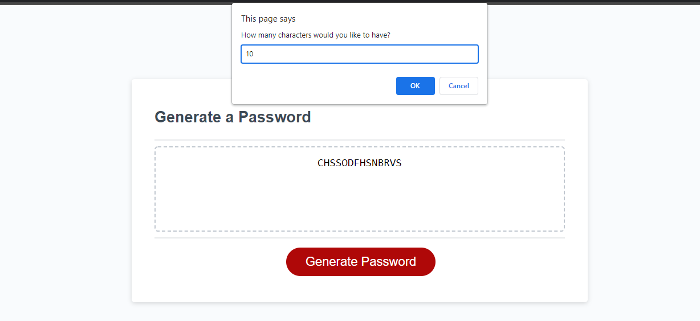
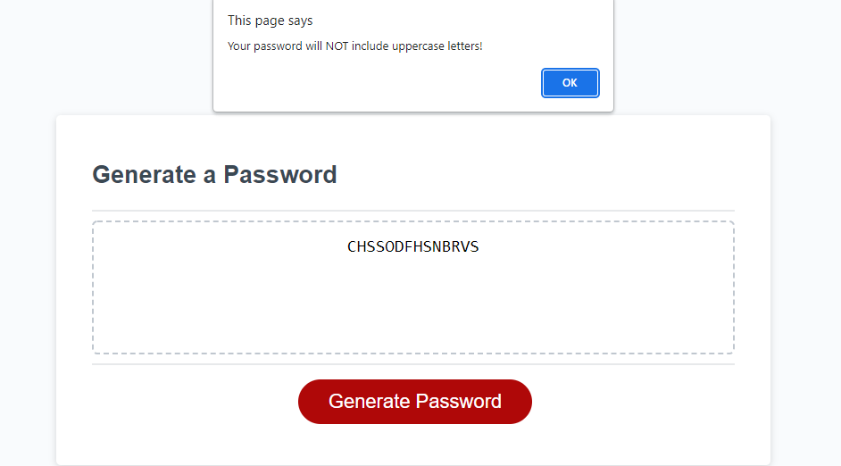
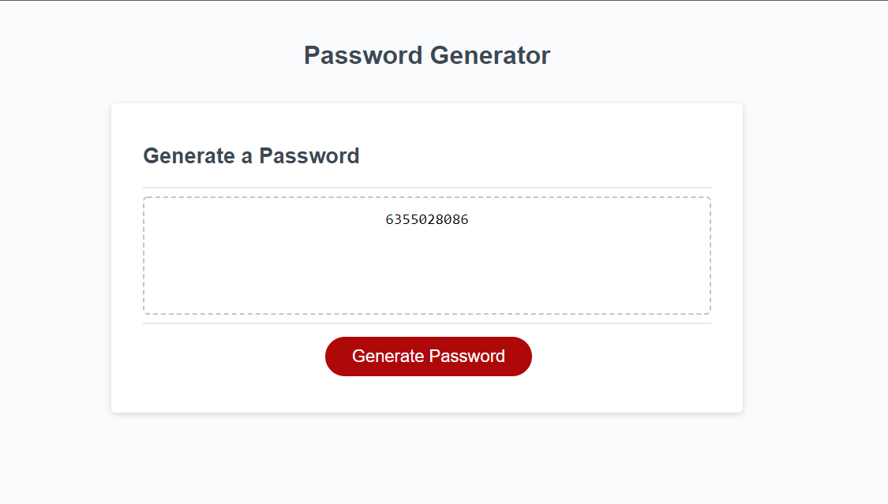

# Randomized JavaScript Password Generator
 
## Description
 
This JavaScript password generator takes user choices from a set of prompts and creates a custom, randomized password based on said selections.
These prompts, and their effect on the password generated, include the usage of uppercase and lowercase letters, numbers and special characters.
Similarly this script allows users to select the length of their password within a given range and subsequently generates a password
of such length. As such a user could choose to create a password of a given length with only uppercase letters, only numbers, or any other combination and have it
randomized.
 
A script similar to this can be found on web browsers such as Google Chrome where a randomized password is offered when creating new passwords.
However unlike Chrome (at least to my knowledge) this password generator allows users to choose which variables they will include in their randomized password,
instead of it being predetermined.
 
This script solves at least two issues many users might face when generating a new, randomized password:
- It allows users to predefine the characteristics of their randomized password (unlike Google Chrome).  
- It helps to strengthen a user's security online by providing a completely random password regardless of how many selectors are chosen.
 
This project was challenging in many ways considering it was the first JavaScript script I've made. With a lot of help from a tutor, and a few peers, I developed a better understanding of how to create
independent strings of choices for (i.e. uppercase letters included in a password while lowercase  is not).
 
 
## Table of Contents
 
- [Installation](#installation)
- [Usage/Examples](#usage//examples)
- [Credits](#credits)
- [License](#license)
 
## Link To Live URL
- [https://skytexier.github.io/Javascript-Password-Generator/](https://skytexier.github.io/Javascript-Password-Generator/)

## Installation
 
For proper installation or usage of the website include index.html and assets folder. Script is found in the assets folder.
No installation required unless modifying code, in such case proper git pulling from the repo and importing into editing software required.
   
## Usage/Examples
Upon clicking the generate password button a prompt will appear asking if you'd like to generate a button.
If a user wanted to generate a password, another prompt will appear to specify how long the password will be, as shown below.
 

 
In some instances, including if a user inputs an incorrect number for the password length (which must be between 8 and 128 characters) another prompt will display alerting them of an invalid input.
 
In the instance pictured below, if a user opts to not include a specific variable (in this case uppercase characters) then the window will alert us with a message to reaffirm we will not be including said variable in the password generation.
 

 
Once all the password prompts have been completed the script will display the newly generated, randomized password in the box.
 

 
Upon completing all the prompts, and generating a randomized password, a user can then click the button again to generate a new password. This will restart the script and erase all previous selections to allow for a new randomized password based upon the variables selected.
 
## Credits
 
For this project I used a few more sources than normal, including a tutor and peers.

# Web Sources
The web sources are as follows:
- GeeksforGeeks [https://www.geeksforgeeks.org/return-keyword-java/#:~:text=In%20Java%2C%20return%20is%20a,Methods%20not%20returning%20a%20value](https://www.geeksforgeeks.org/return-keyword-java/#:~:text=In%20Java%2C%20return%20is%20a,Methods%20not%20returning%20a%20value)
- ExamTray [https://www.examtray.com/java/java-program-how-print-random-element-or-index-array-arraylist](https://www.examtray.com/java/java-program-how-print-random-element-or-index-array-arraylist)
- MDN [https://developer.mozilla.org/en-US/](https://developer.mozilla.org/en-US/)
- MDN Loops and Iterations [https://developer.mozilla.org/en-US/docs/Web/JavaScript/Guide/Loops_and_iteration](https://developer.mozilla.org/en-US/docs/Web/JavaScript/Guide/Loops_and_iteration)

# Tutors
The tutor I worked with (Alexis San Javier) helped me understand how my variables could contain strings for the final password variable, and too how we could create a variable that would catch all of our subsequent additions or modifications in the function. For example var passwordFinal = ""; and var password - "";
Similarly he helped me better understand how our boolean inputs from the prompts could change how the function works. Lastly we worked together on iterating our variables, but most of my understanding of how that would work within the function came from my peers.

# Peers
The peers I worked with helped me to better understand the last section of my generatePassword function, and together we brainstormed and implemented the ability to restart our generate password function if the first prompt was false (i.e. if "Would you like to generate a new password" was false). I helped them to better understand the prompt variables and how their boolean characteristics would change the function.
 
- Braxton Minkey [https://github.com/BrackyM](https://github.com/BrackyM)
- Ishwardeep Anand [https://github.com/ianad389](https://github.com/ianad389)
 
 
## License
MIT License
 
Copyright (c) [2022] [Sky Hamilton Texier]
 
Permission is hereby granted, free of charge, to any person obtaining a copy
of this software and associated documentation files (the "Software"), to deal
in the Software without restriction, including without limitation the rights
to use, copy, modify, merge, publish, distribute, sublicense, and/or sell
copies of the Software, and to permit persons to whom the Software is
furnished to do so, subject to the following conditions:
 
The above copyright notice and this permission notice shall be included in all
copies or substantial portions of the Software.
 
THE SOFTWARE IS PROVIDED "AS IS", WITHOUT WARRANTY OF ANY KIND, EXPRESS OR
IMPLIED, INCLUDING BUT NOT LIMITED TO THE WARRANTIES OF MERCHANTABILITY,
FITNESS FOR A PARTICULAR PURPOSE AND NONINFRINGEMENT. IN NO EVENT SHALL THE
AUTHORS OR COPYRIGHT HOLDERS BE LIABLE FOR ANY CLAIM, DAMAGES OR OTHER
LIABILITY, WHETHER IN AN ACTION OF CONTRACT, TORT OR OTHERWISE, ARISING FROM,
OUT OF OR IN CONNECTION WITH THE SOFTWARE OR THE USE OR OTHER DEALINGS IN THE
SOFTWARE.